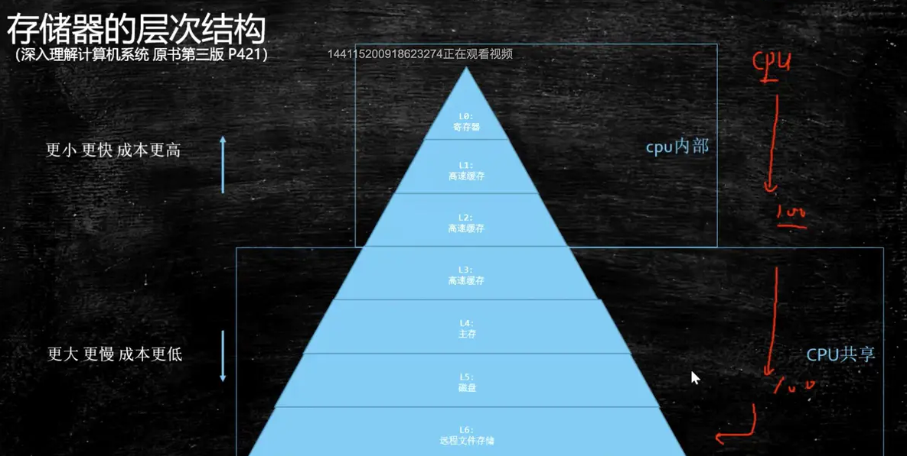
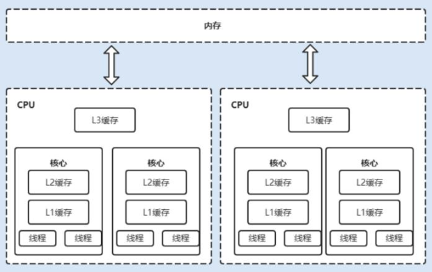

CAS：compare and swap，比较-交换，**读取->比较->交换这三个指令组成一个原子操作**。在单核 CPU 和多核 CPU 下都能够保证操作的原子性。

读取->比较：*读取到的值*与*预期的值*进行比较，相同则交换，不同则不进行交换。

**预期的值怎么理解？**一个线程从主内存中读取到x1，对x1进行操作产生新的值x2，此时从主内存再次读取，如果是x1则更新为x2，否则循环对比，直到成功为止。

**关于ABA问题：**有个线程T1去修改了x1，进行操作后，又写会x1。虽然都是x1，但是已经不是之前读取的x1了。
1、添加版本号 
2、AtomicStampedReference：检查预期引用+预期标志

**循环耗时：**“*直到成功为止*”，占用cpu资源

##### Java-CAS API：

AtomicLongFieldUpdater：基于反射机制，确保类型和字段名称正确；

java9以后提供VariableHandle API，提供各种粒度的原子操作和有序性的操作。

**CAS场景：**并发较低的情况，比synchronized效果好；并发较高会占用cpu。

##### CAS 底层

CPU多级缓存：

**总线锁定：**cpu1处理共享数据时，向BUS总线发送lock信号，其他cpu则无法操作**内存**；如果其他cpu要处理该共享数据，则进入阻塞状态。总线锁，**锁定的是其他CPU与内存的通信**。

**缓存锁定：**cpu1处理共享缓存数据时，其他cpu会有个嗅探机制，该机制可让其他cpu对该共享数据的缓存失效，待其他cpu读取时会重新从主内存中读取最新数据。基于MESI缓存一致性协议来实现。

这两种锁定如果进行触发？操作的数据跨多个缓存行，则使用总线锁定；不支持缓存锁定的cpu，使用总线锁定。

CISC(复指令集、X86)：cmpxchg 指令
RISC(简指令集、ARM)：load and reserver 和store conditional两个指令实现

**MESI协议：**是以缓存行的状态命名的。该协议要求在每个缓存行增加两个状态位

* M：被修改的，只有在本cpu有缓存，其他cpu没有；内存中的数据是旧的，还没有进行更新。
* E：独占，只有在本cpu有缓存，其他cpu没有，数据没有被修改，与内存中一致
* S：共享，多个cpu中都有缓存，与内存一致
* I：无效，本cpu中缓存已经失效

***题外话***

cas的原子性：在x86/64直接读取8字节操作也仅仅在不跨越cache line时保证其原子性，并非读取都是原子性。

*资料*

[(24条消息) Java无锁并发详细教程_夏小白.的博客-CSDN博客_java无锁并发](https://blog.csdn.net/xia1140418216/article/details/121007970)

[并发编程之无锁 - 云+社区 - 腾讯云 (tencent.com)](https://cloud.tencent.com/developer/article/1587913)
[关于各种CPU架构的CAS原子操作的疑惑？ - 知乎 (zhihu.com)](https://www.zhihu.com/question/54882419)