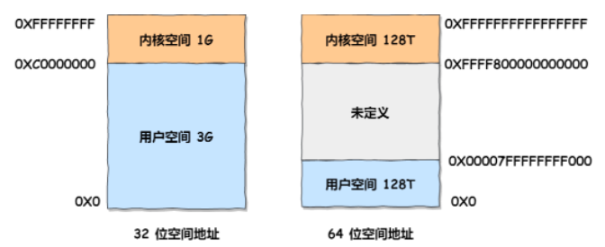

xms：初始堆内存大小

xmx：最大堆内存大小

##### 申请内存大于实际物理内存

无法启动，会报错：`Error occurred during initialization of VM`

进程通过malloc函数申请内存，拿到的是*虚拟内存*。当进程去使用虚拟内存的时候，如果CPU发现虚拟内存并没有映射到物理内存，CPU会产生*缺页中断*。此时，进程会从用户态转换到内核态，缺页中断函数会查看物理内存是否足够：

* 如果足够：直接分配物理内存，并建立虚拟内存与物理内存的映射关系。
* 不足够：内核就会开始回收内存，回收内存后：
  * 足够：直接分配，并建立虚拟与物理映射关系。
  * 不足够：OOM，报错了。

32bit-OS与64bit-OS*虚拟地址空间*大小不同：

在32bit-OS申请8G内存，在虚拟申请阶段就会失败，因为最大就3G。
在64bit-OS申请8G内存，没问题。

**如果在物理内存4G的64bit-OS申请8G内存会有什么问题？**

申请是没有问题的，如果使用的话就需要物理内存。如果申请内存大于物理内存大小，先判断是否开启Swap：

* 没有开启：直接oom
* 开启：将一部分很长时间没有什么操作的进程所占用物理内存保存到磁盘，并释放对应的物理内存(等该进程需要运行的时候再转回物理内存中)。释放的物理内存就可以使用了。

Linux提供两种swap方式：

* swap分区：基于硬盘的独立分区
* swap文件：基于文件系统

*资料*

[我的文章上榜首了！ (qq.com)](https://mp.weixin.qq.com/s/3Q98ywd6oh0GlmD9_OiGmg)