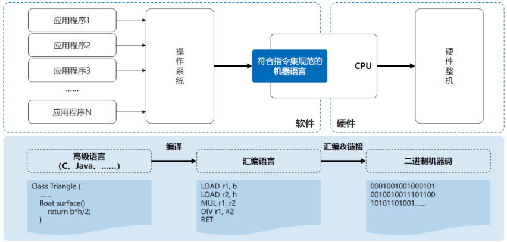
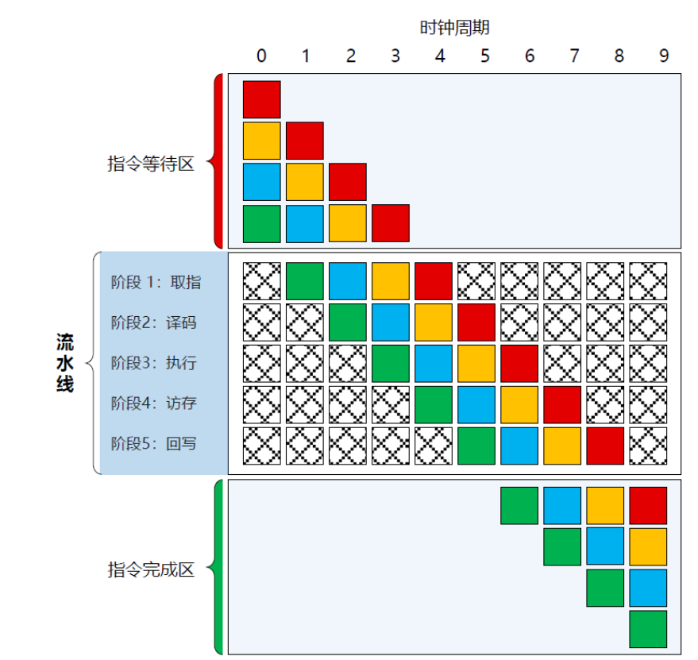
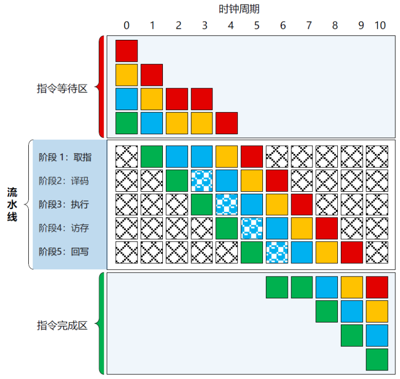

不同CPU有不同的机器指令集，写出来的程序不具备移植性。

高级语言不能被CPU直接执行，需要经过编译、汇编、链接等处理，才能将高级语言转换为**cpu的机器指令，这些指令的集合称为指令集架构**。

**指令集是CPU的顶层设计规范，微架构是顶层设计规范的物理实现。**微架构：cpu内部硬件结构。
微架构：X86、ARM

##### CISC在什么背景下产生的？

在1970年代，都使用汇编进行程序的编写，汇编语言具有机器相关性，程序员需要深入了解机器资源的细节，清楚每个资源的使用情况，程序设计非常复杂，开发效率低下。基于此，指令集应该是越丰富越好，常用的操作都有现成的指令，特定的功能也有对应的指令，这样就可以高效的写代码。即所谓的抹平差异，抹平机器指令与编程指令之间的差异。因此，**通过不断的增加新的复杂指令或增强原有功能实现原本应由汇编程序实现的功能，就变得越大越复杂。**

在1970年代，内存都是直接焊在主板上的，容量一般64kb，所以内存容量和速度是性能的最大瓶颈。以至于程序包的大小被作为执行速度的一个间接衡量标准，也就是说每条指令都尽可能执行更多的任务，进而减少内存占用。

**不同的复杂指集存在冗余的晶体管电路，如何进行复用？**

> 为了解决这个问题，CISC引入了**微码**。微码：将一条复杂指令拆解成多个微操作，每个微操作是CPU内部最小操作原语，直接控制电路开关等硬件操作，可以被CPU直接执行。
>
> 微码是介于机器码和CPU硬件中间，实现了机器指令和CPU的解耦。微码的出现可以让CPU工程师在设计阶段通过微程序的方式实现一条机器指令，而不是通过设计硬件电路实现它。
>
> 复杂指令对应1~4个微码，多数是3个。微码一般存储在CPU的ROM中，在CPU出厂前进行烧录。如果微码存在bug，修复的补丁存在cpu的RAM中，OS内核或主板的BIOS在引导时进行加在和更新微码。

##### CISC的问题？

实现CISC指令的硬件会非常臃肿。维护、可靠性、硬件复杂度和成本都会上升。因为复杂指令集将代码的复杂性转移到硬件层面，用于缓解编程复杂性和空间不足问题。后来，复杂指令集越来越臃肿，硬件研发成本不断增加，研发周期不断延伸，编译器为了适应复杂指令集也得随之迭代。

* 指令浪费严重：内卷严重，过度设计
* 硬件设计日趋复杂：指令复杂度高，电路就越复杂，设计难度越大，散热、功耗也越大
* 编译器实现难度大：复杂指令集数量不断上升，编译器实现越来越难，而且很难充分利用各种指令集特性。

##### RISC又是怎么来滴？

1980年，RISC的设计思想，主张硬件应该专注加速常用的指令，而较为复杂的指令则由常用指令组合实现。

**RISC主要设计思想：**

* 精简指令本身的复杂度，减低硬件设计难度和制造成本：复杂指令拆解为简单指令，简单指令通过灵活组合来代替，从而让硬件设计简单化，电路面积更小，成本更低。
* 专用的load和store指令，弥补CPU与内存之间的性能鸿沟：鸿沟来自CPU执行指令的速度快，内存取指的速度慢，在内存频繁被CPU操作的情况下，内存的访问速度就是瓶颈。RISC规定load和store专门用于内存读写，其他指令只能操作寄存器。load和store访问机制减少了指令直接访问内存次数，CPU的运算都操作在寄存器上，降低了内存取指的性能影响。*load内存加载到寄存器，store寄存器写回内存中。*
* 等长的指令执行时间和高速缓存，使多级指令流水线作业成为可能，计算性能大幅提升：load和store内存访问机制还带来了指令流水线。指令流水线：把一条指令的执行划分为若干阶段（例如，取值、译码、执行、访存、回写）来减少每个时钟周期的工作量，并允许多条指令的不同阶段重叠执行，实现并行处理。下面是**完整流水线**示意图：

若流水线中的指令被延迟处理而需要等待数个时钟周期，就被称作“**非完整流水线**”。非完整流水线示意图：

为了保证流水线的工作效率，流水过程不应经常出现“打嗝”现象，实现流水的各个阶段所需的时间应该尽可能保持相等。为此，RISC指令集有一条重要的设计原则，即：**所有从内存到CPU执行的指令，都遵循一种恒定的流形式，每条指令都是标准、固定长短的，与计算机存储字长和数据字长相等，所有指令以同样的步调执行，一个时钟周期完成一条指令的执行。**

**CISC无法做到RISC的低功耗，RISC也很难做到CISC的高性能。**

**ROM：**在主板的BIOS芯片中，主要是启动自检。ROM本意是只读存储器，但是现在的ROM基本都是可改写，比如升级BIOS固件都是通过改写ROM实现的。

**RAM：**随机存储器，内存。

*资料*

[算力简史（四）：指令集架构之争 (qq.com)](https://mp.weixin.qq.com/s/5sEvqmlZcjMIYa6NHVepTw)