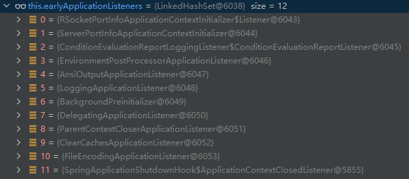

##### WebApplicationType

默认：WebApplicationType.SERVLET

SpringFactoriesLoader:
```java
//org.springframework.boot.BootstrapRegistryInitializer//初始化没有值

private static Map<String, List<String>> loadSpringFactories(ClassLoader classLoader) {
   Map<String, List<String>> result = cache.get(classLoader);
   if (result != null) {
      return result;
   }

   result = new HashMap<>();
   try {
      Enumeration<URL> urls = classLoader.getResources(FACTORIES_RESOURCE_LOCATION);
       //AppClassLoader.getResources("META-INF/spring.factories");
       //spring.factories文件中声明了一大堆需要加载的类，下面就是对文件记录的处理
       //urls:file:/***/spring-boot-2.6.5.jar!/META-INF/spring.factories
      while (urls.hasMoreElements()) {
         URL url = urls.nextElement();
         UrlResource resource = new UrlResource(url);
         Properties properties = PropertiesLoaderUtils.loadProperties(resource);
          //加载spring-boot-2.6.5.jar的配置
         for (Map.Entry<?, ?> entry : properties.entrySet()) {
            String factoryTypeName = ((String) entry.getKey()).trim();
            String[] factoryImplementationNames =
                  StringUtils.commaDelimitedListToStringArray((String) entry.getValue());
             //按照,号进性分割成数组
            for (String factoryImplementationName : factoryImplementationNames) {
               result.computeIfAbsent(factoryTypeName, key -> new ArrayList<>())
                     .add(factoryImplementationName.trim());
            }
            //原来：“A” -> “a,b,c”
            //转换：“A” -> ["a","b","c"]
         }
      }

      // Replace all lists with unmodifiable lists containing unique elements
      result.replaceAll((factoryType, implementations) -> implementations.stream().distinct()
            .collect(Collectors.collectingAndThen(Collectors.toList(), Collections::unmodifiableList)));
      cache.put(classLoader, result);
   }
   catch (IOException ex) {
      throw new IllegalArgumentException("Unable to load factories from location [" +
            FACTORIES_RESOURCE_LOCATION + "]", ex);
   }
   return result;
}
```
#####Class.forName
```java

Class.forName("",true,new URLClassLoader(null));
//JVM查找并加载指定的类，即会执行该类的静态代码段
.newInstance();//会执行无参构造函数
```

```java
new RuntimeException().getStackTrace();
//当前线程的堆栈信息，可用于查找调用当前方法的调用链
```
```java
public ConfigurableApplicationContext run(String... args) {
   long startTime = System.nanoTime();
   DefaultBootstrapContext bootstrapContext = createBootstrapContext();
   ConfigurableApplicationContext context = null;
   configureHeadlessProperty();
   //java.awt.headless：true->缺少显示屏、鼠标、键盘等
   SpringApplicationRunListeners listeners = getRunListeners(args);
    //运行监听器SpringApplicationRunListener.class
   listeners.starting(bootstrapContext, this.mainApplicationClass);
    //监听器开启topic:spring.boot.application.starting
   try {
      ApplicationArguments applicationArguments = new DefaultApplicationArguments(args);
      ConfigurableEnvironment environment = prepareEnvironment(listeners, bootstrapContext, applicationArguments);//准备环境、配置文件
       //properties准备，如：profile
       //EnvironmentPostProcessorApplicationListener
       //org.springframework.boot.context.config.ConfigDataEnvironment
       //AbstractEnvironment.ACTIVE_PROFILES_PROPERTY_NAME
       //ConfigurationPropertySource
       
      configureIgnoreBeanInfo(environment);//spring.beaninfo.ignore=true
      Banner printedBanner = printBanner(environment);//打印logo 
       //org.springframework.boot.SpringBootBanner 
      context = createApplicationContext();//创建上下文
       //AnnotationConfigServletWebServerApplicationContext
      context.setApplicationStartup(this.applicationStartup);
       //DefaultApplicationStartup
       
      prepareContext(bootstrapContext, context, environment, listeners, applicationArguments, printedBanner);
       /**
1.打印springboot及项目信息:
 日志内容：org.springframework.boot.StartupInfoLogger
 pid：org.springframework.boot.system.ApplicationPid#getPid
 
2.***Application启动类注册
org.springframework.context.annotation.AnnotatedBeanDefinitionReader#doRegisterBean

3.加载启动类注解
org.springframework.boot.BeanDefinitionLoader
	Class.isAnonymousClass():用于检查基础类是否匿名
org.springframework.context.annotation.AnnotatedBeanDefinitionReader#doRegisterBean
	org.springframework.util.ConcurrentReferenceHashMap
	org.springframework.core.annotation.AnnotationsScanner#getDeclaredAnnotations
     */
      refreshContext(context);
/**
1.添加关闭钩子：Runtime.getRuntime().addShutdownHook(new Thread(this, "SpringApplicationShutdownHook"));//在jvm关闭时调用的钩子，系统执行完“钩子”jvm才关闭。
2.刷新上下文：
org.springframework.boot.web.servlet.context.ServletWebServerApplicationContext#refresh
org.springframework.context.support.AbstractApplicationContext#refresh
3.IOC
org.springframework.context.annotation.ConfigurationClassParser#parse(java.util.Set<org.springframework.beans.factory.config.BeanDefinitionHolder>)
org.springframework.context.annotation.ConfigurationClassPostProcessor#processConfigBeanDefinitions
org.springframework.context.annotation.ComponentScanAnnotationParser#parse
org.springframework.context.annotation.ClassPathScanningCandidateComponentProvider#scanCandidateComponents
	org.springframework.core.io.support.ResourcePatternResolver#CLASSPATH_ALL_URL_PREFIX
根据路径加载类：org.springframework.core.io.support.PathMatchingResourcePatternResolver#getResources
org.springframework.context.annotation.ConfigurationClassPostProcessor#processConfigBeanDefinitions
根据filePath进行应用class文件读取：
	org.springframework.core.io.support.PathMatchingResourcePatternResolver#doRetrieveMatchingFiles
根据读取到的文件进行class加载：
org.springframework.context.annotation.ConfigurationClassBeanDefinitionReader#loadBeanDefinitionsForConfigurationClass
	如果有ResourcePatternResolver类去加载的时候，会进行加载mapper/*.xml->取决于getResources传入了什么。
4.ThemeSource初始化：org.springframework.ui.context.support.UiApplicationContextUtils#initThemeSource
5.启动tomcat：
org.springframework.boot.web.embedded.tomcat.TomcatServletWebServerFactory#getWebServer
org.springframework.boot.web.embedded.tomcat.TomcatWebServer#initialize
6.实例化所有剩余的（非惰性初始化）单例。
org.springframework.beans.factory.support.DefaultListableBeanFactory#preInstantiateSingletons
*/
      afterRefresh(context, applicationArguments);//狗屁~空的，啥也没干
      Duration timeTakenToStartup = Duration.ofNanos(System.nanoTime() - startTime);
      if (this.logStartupInfo) {
         new StartupInfoLogger(this.mainApplicationClass).logStarted(getApplicationLog(), timeTakenToStartup);//打印启动日志
      }
      listeners.started(context, timeTakenToStartup);
      callRunners(context, applicationArguments);
	/**启动ApplicationRunner或CommandLineRunner的 */
   }
   catch (Throwable ex) {
      handleRunFailure(context, ex, listeners);
      throw new IllegalStateException(ex);
   }
   try {
      Duration timeTakenToReady = Duration.ofNanos(System.nanoTime() - startTime);
      listeners.ready(context, timeTakenToReady);
   }
   catch (Throwable ex) {
      handleRunFailure(context, ex, null);
      throw new IllegalStateException(ex);
   }
   return context;
}
```

```java
//在new Thread(启动器).getDelMethodName("main").invoker();
//只有并没有停止，而是调用了Thread.exit方法，
//系统调用此方法是为了让线程在实际退出之前有机会进行清理。
java.lang.Thread#exit
```

##### 

##### ConfigurableEnvironment ：配置信息都在里面了，可使用@Autowired获取

##### ConfigurableApplicationContext

​	实现了Closeable，try-catch-resources语法创建的资源抛出异常后，jvm会自动调用close方法进行资源释放。

##### BeanDefinitionLoader：Bean定义加载器

##### java 获取注解：

​	class.forname("").getAnnotations();

*资料：*

[(24条消息) 从0-1了解SpringBoot如何运行（一）：Environment环境装配_原来是笑傲菌殿下的博客-CSDN博客](https://blog.csdn.net/Laugh_xiaoao/article/details/123982865)
