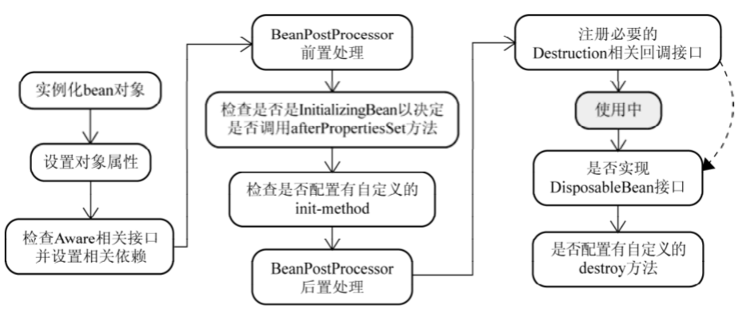

IOC：控制反转，创建对象的控制权的转移，如果没有spring，需要自己创建对象，有了spring交给spring创建。

DI：依赖注入，应用程序在运行时依赖容器动态注入外部资源类。

**Bean的定义：**
	1、Resource定位：根据配置的位置，进行资源的定位
	2、BeanDefinition载入：将Resourece定位到的信息，保存到BeanDefiniton中
	3、BeanDefinition注册：将BeanDefinition的信息发布到IOC容器
这里的Bean只进行了载入，并没有开始实例化及依赖注入。

如果配置lazy-init，默认false，即自动初始化Bean。如果true，只有getBean的时候，才会执行实例化，完成依赖注入。

**Bean的实例化：**


**采用了```策略模式```来解决如何bean实例化：**
	InstantiationStrategy实例化策略接口
		SimpleInstantiationStrategy：继承InstantiationStrategy，通过反射实例化
			CglibSubClassingInstantiation:继承SimpleInstantiationStrategy，反射实例化，具有CGLib动态字节码生成实例的功能。

**设置对象属性：**
	Spring根据实例构造一个BeanWrapperImpl实例，然后将PropertyEditor复制一份给BeanWrapperImpl实例，然后进行属性的设置

**处理Aware接口：**
	如果实现BeanNameAware，则调用setBeanName方法
	如果实现BeanFactoryAware，则调用setBeanFactory方法
	如果实现ApplicationContextAware，则调用setApplicationContext方法

**BeanPostProcessor：**主要用于Spring-aop来生成代理对象

```java
public interface BeanPostProcessor {
   @Nullable//前置处理
   default Object postProcessBeforeInitialization(Object bean, String beanName) throws BeansException {      return bean;   } 
   @Nullable//后置处理
   default Object postProcessAfterInitialization(Object bean, String beanName) throws BeansException {      return bean;   }
}
```

**Bean初始化：**
	BeanPostProcessor前置处理之后，检测对象是否实现InitializingBean接口，实现则调用afterPorpertiesSet方法。查看Bean中是否声明init-method属性，如果声明则调用(主要用于对Bean初始化前的准备操作)。

***********Bean实例化结束***********

**Bean的销毁：**
	检查单例类型的Bean是否实现DisposableBean接口，或者是否声明destory-method属性，实现则注册对象销毁回调方法；


**IOC如何实现：**

	* 读取配置文件、注解，查看Bean依赖的哪个对象，拿到类名
	* 使用反射API，基于类名进行实例化
	* 将对象实例，通过构造函数或者setter传递给Bean

​	
