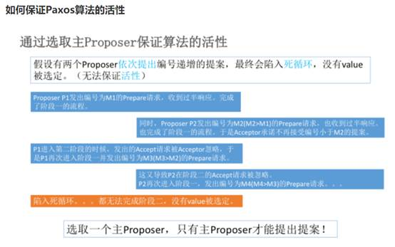
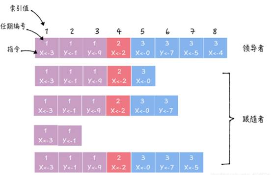
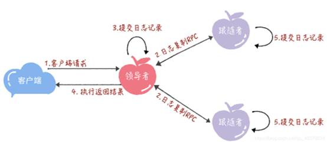

一个分布式系统中各个节点如何就某一个值达成一致。

 

Paxos算法：

一种基于消息传递的分布式一致性算法。主要用于允许宕机的分布式系统中，可容忍消息丢失、延迟、乱系以及重复。并利用大多数机制保证2F+1的容错能力。F：最多允许出现问题的节点。

流程：

Paxos将系统角色分为提议者、决策者、最终决策学习者。一个节点可以充当这三个角色。

提案：最终的达成一致的值就在这里。

提议者(Proposer)：提出提案，包括：提案编号和提案值。

决策者(Acceptors)：对提议者提出的提案进行决策，提案获得过半决策者通过则代表通过。

最终决策学习者(Learner)：不参与决策，学习最新通过的提案(获取达成一致的值)。

 

Prepare阶段：提议者向决策者发送**预请求**，决策者收到该请求后返回**承诺**。

​            *提议者发出的预请求含有全局唯一且递增的提案ID，无需包含提案内容。
​            提案ID唯一性：时间戳+ServerID*

Accept阶段：提议者收到多数决策者的承诺后，向决策者发送**提名请求**，决策者收到该请求后进行决策处理。决策者已接收的提案ID是最大的；已响应的请求是最大提案ID。

​           *决策者收到提议者的预请求之后，执行“两承诺，一应答”：*

n *两承诺：不再接受<=预请求提案ID的请求；
 不再接受<提名请求ID的请求。*

n *一应答：在不违背Prepare阶段承诺的前提下，返回已经通过提案中提案ID最大的那一个；没有通过返回空。*

Learn阶段：提议者在收到多数决策者返回的决策后，决议形成，发送给所有最终学习者。

*提议者在收到多数决策者的决策后，从应答中选择提案ID最大的一个，作为本次的提案；若为空，则由提议者随意决定提案。、*

step1：获取一个提案ID；

step2：提议者向所有决策者发送预请求；

step3：决策者收到预请求之后，比较提案ID大小，获取最大的一个，并返回承诺；

step4：提议者收到决策者的过半数的返回后，若存在通过提案，将作为提案；否则任意选择一个提案；

step5：广播通过的提案；

step6：决策者收到提案后，若提案ID>本地之前持久化的ID，本地持久化提案ID后返回；否则返回当前本地的提案ID；

step7：提议者收到过半的决策者返回后，如果发现有返回值大于提案ID，表示有更新的提案，返回step1；否则达成一致。

Basic Paxos算法只能对一个值进行决议，并且至少两次网络来回。只能用于理论研究，不能直接应用于实际工程中。因为实际工作中，往往需要对对个值进行决议，故产生了Multi-Paxos算法。

Multi-Paxos算法：

**对basic-paxos进行改进：**

1、 对每一个要确定的值，运行一次base-paxos算法，形成决议。

2、 在所有提议者中选举一个leader，由leader唯一的提交给提案给决策者进行表决，这样就解决了提议者的竞争问题，解决了活锁问题。因为只有一个leader，Prepare阶段可以取消变为两阶段，进而提高效率。

leader是通过basic-paxos得出。

Raft算法：

属于multi-paxos算法，是通过以领导者为准的方式，实现共识的。

从多副本状态机的角度出发，用于管理多副本状态机的日志复制。

角色：

领导者leader：负责处理写请求、管理日志复制、不断发送心跳信息。通知其他节点leader还活着，不要自立为王。

跟从者follower：接受并持久化领导者同步的日志，在领导者通知提交日志后，提交日志。在接受leader消息超时后，变为candidate。

候选人candidate：领导者选举过程中的临时角色。候选人向其他节点发送投票请求，如果赢得大多数选票，则变为leader。

*在任意时刻只有一个leader；正常工作期间只有leader和follower。*

*日志复制RPC：由leader发起，用来复制日志和提供心跳信息*

选举：

**每个follower对leader的超时时间是随机的**，那么如果A节点的超时时间最短，也就是最先发现没有leader的节点，那么A节点follower->candidate，并给其他节点发送投票请求。其他节点收到请求后比较本地任期编号，若在这届任期内没有进行投票，则把A作为投票对象，并增加自己的任期编号。收到大多数投票后，A变为leader节点，并A节点定时发送心跳信息。

*任期编号是自增的，如果发现自己的编号比其他节点小，则变为最大。*

*如果一个节点收到比自己小的任期编号，则直接拒绝。*

*一个节点在一个任期内只能投出一张票，并按照先到先得的原则进行投票。并任期编号大的不会给任期编号小的投票。*

*除了leader的心跳消息超时时间是随机的外，还有选举投票超时时间也是随机的，也就是说如果在这个随机时间内，candidate无法获取过半投票则失去选举资格，发起新一轮选举。*

日志复制

副本数据是以日志的形式存在的，日志由日志项组成，日志项是一种数据格式。

日志项主要包含：用户指令，索引值，任期编号等。

指令：有客户端请求指定的、状态机需要执行的指令，即客户端指定的数据。

索引值：日志项对应的索引值，是一个连续、递增的证书号码。

任期编号：创建这条日志项的leader的任期编号。

**如何复制？**

**leader****通过日志复制rpc消息，将日志项复制到集群其他节点上。接着leader收到大多数follower复制成功的消息后，将日志项应用到他的状态机，并返回客户端-成功。如果没收到多数follower的消息后，返回客户端为错误。**

**leader****将日志项应用到他的状态机，如何通知follower进行该动作？**

**leader****日志复制rpc或心跳消息，包含了当前最大的、将被提交的日志项索引值。follower可以据此直到leader的日志项位置。**

**leader****收到大多数节点复制成功响应，改变自己状态机。如果此时由节点不在大多数中，他们怎么进行同步？**

日志项一致性是通过**PRC一致性检查**进行处理的，找到follower中与leader相同日志项的最大索引，然后把后面的日志项同步过去，让follower进行更新。

 

 

*资料*

[分布式系列文章——Paxos算法原理与推导 - lzslbd - 博客园 (cnblogs.com)](https://www.cnblogs.com/linbingdong/p/6253479.html)

[(27条消息) Raft算法详解_邋遢的流浪剑客的博客-CSDN博客_raft算法](https://blog.csdn.net/qq_40378034/article/details/117404484)

[MyBatis中文官网](http://www.mybatis.cn/raft/1583.html)