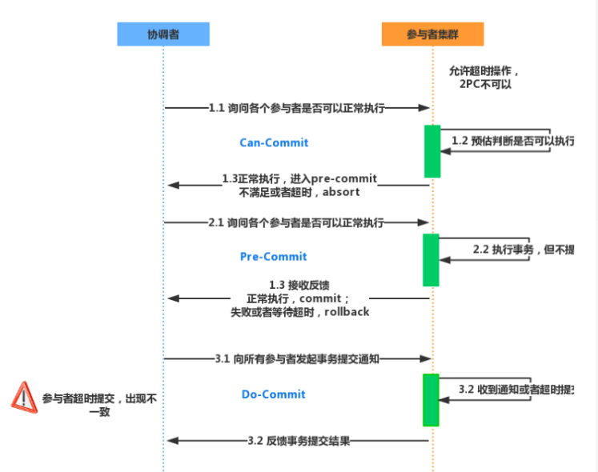

#### **分布式事务协议：**

**2PC：**两阶段提交。两阶段：完成整个分布式事务，需要两个步骤完成。

**3PC：**三阶段提交，很难实现

**常见分布式事务解决方案**：大多数都采用2PC协议

* seata阿里的分布式事务框架
* 消息队列
* sage
* XA

##### 2PC两阶段提交协议

第一阶段：所有事务参与者，执行后进行预提交，直到协调者收到所有参与者的预提交才会进入第二阶段。如果协调者发现有的参与者没有提交或者超时，都会结束事务。
第二阶段：所有参与者都进行预提交，由协调者决定事务提交最终是否成功。

**二阶段缺点：**

* 执行过程中，参与者都是事务阻塞，如果某个参与者占有公共资源，其他节点访问公共资源处于阻塞状态。

* 参与者发生故障，协调者为每个参与者设定了超时时间，超时则事务失败，没有容错机制。

* 协调者发生故障，参与者一直处于阻塞，需要额外的备用机器进行容错。

  **2PC无法解决的问题：**协调者发出提交消息之后宕机，唯一收到消息的参与者也宕机，事物的状态则处于不确定状态。故有了3PC。

##### 3PC三阶段提交协议

在协调者和参与者都引入超时机制
在第一阶段和第二阶段之间插入准备阶段。保证最后提交阶段之前各参与节点的状态是一致的。

**1、CanCommit阶段：**与2PC的准备阶段很像。
事务询问：协调者向参与者发送commit请求，
响应反馈：参与者如果认为自身可顺利执行事务则返回Y，否则返回N；
**2、PreCommit阶段：**协调者根据参与者响应情况来决定是否执行事务PreCommit操作，即有两种可能。
*可1*：如果都是Y则执行PreCommit操作
协调者向参与者发送PreCommit请求，并进入PrePared阶段；
参与者收到PreCommit请求，执行事务操作，并将undo和redo信息记录到事务日志；
如果参与者成功执行事务操作，返回ACK响应，同时等待最终指令。
*可2*：如果存在返回N或者超时了，那么执行事务中断
协调者向参与者发送abort请求；
参与者收到abort请求，执行事务中断。
**3、DoCommit阶段：**真正进行提交事务，可分两种情况。
*可1*、执行提交：
协调者接收到参与者发送ACK响应，将从预提交转为提交状态，并向所有参与者发送DoCommit请求；
参与者收到DoCommit请求，执行正式的事务提交，并在完成事务提交之后释放所有事务资源；
参与者事务提交完成之后，发送ACK响应；
协调者收到所有参与者ACK响应之后，完成事务。
*可*2、中断事务：协调者没有收到ACK响应，则执行事务中断
协调者向参与者发送abort请求；
参与者收到abort请求，利用在PreCommit阶段记录的undo信息来执行事务的回滚，并在完成回滚之后释放所有的事务资源；
参与者完成事务回滚之后，发送ACK响应；
协调者收到ACK响应之后，执行事务中断。

#### AT模式

是一种**无侵入**式的分布式事务解决方案，seata阿里的分布式事务框架实现了该模式。
用户只需要关注业务SQL，用户的SQL作为一阶段，seata框架会自动生成事务二阶段提交和回滚操作。
一阶段：seata拦截业务SQL，解析业务SQL，找到业务SQL更新的数据，在更新前将其保存成before image，然后执行业务SQL，更新之后保存成after image，最后生成行锁。以上操作都在一个数据库事务内完成，保证一阶段原子性。
二阶段：

* 二阶段提交：因为业务SQL在一阶段已经提交至数据库，所以seata框架只需要before image、after image、行锁删除即可。
* 二阶段回滚：首先校验脏写，对比数据库当前数据和after image没有区别则没有脏写，之后使用before image恢复数据；如果出现脏写需要转人工处理；最后删除before image、after image、行锁。

#### TCC模式

需要用户根据自己需要实现一阶段/二阶段。**性能好**。

#### sage模式

是一种补偿协议，分布式事务内有很多参与者，每个参与者都是一个冲正补偿服务，需要根据业务场景实现其正向操作和逆向回滚操作的一种**长事务**解决方案。

适用于业务流程长且需要保证事务最终一致性的业务系统。

优势：

* 一阶段提交本地数据库事务，无锁，高性能；
* 参与者采用事务驱动异步执行，高吞吐；

缺点：

* 由于一阶段已经提交数据库事务，没有进行原数据保存，不能保证隔离性。

#### XA模式

是一种**强一致**性的解决方案，被Oracle、DB2、SQL Server、MySQL等支持；开源框架：atomikos

XA接口函数由数据库厂商提供；JTA是java实现的XA规范的增强版接口。

XA需要一个协调器，每一个数据库完成事务后，进行一阶段提交，并将结果通知该协调器。协调器等待所有分支事务操作完成，都进行预提交之后，进入第二步：协调器通知每个数据库进行提交/回滚。
XA中协调器叫TM；数据库是RM。

XA模式事务粒度大，性能低，因此很少使用。

*资料*
https://zhuanlan.zhihu.com/p/78599954
[(24条消息) 分布式事务_三阶段提交(3PC)协议_pseudonym_的博客-CSDN博客_三阶段提交](https://blog.csdn.net/pseudonym_/article/details/88035168)
[分布式：分布式事务（CAP、两阶段提交、三阶段提交） - Hello-Brand - 博客园 (cnblogs.com)](https://www.cnblogs.com/wzh2010/p/15311142.html)