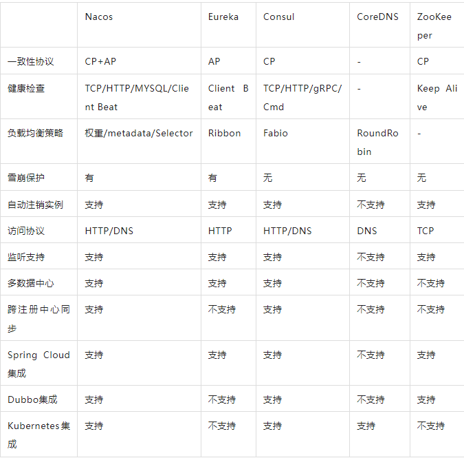

解决方案：

* 应用内：集成到应用中，依赖应用自身服务的注册与发现，例如：Eureka，ZK
* 应用外：应用外单独部署，减少对应用的侵入性，例如：SmartStack，Consul
* DNS：特殊的应用外注册方式，将服务注册为DNS的SRV记录，例如：SkyDNS

ZK保证一致性，牺牲了可用性，不能保证每次请求都是可达的。*在大多数涉数据存储的场景，数据一致性应该是首先被保证的。*ZK选举时间30~120s，会导致选举期间服务不可用。如果在云部署情况下，网络的抖动使得zk失去master节点是大概率事件。

Eureka采用去中心化架构，没有master、slave之分，节点彼此知晓，不会像ZK使得网络瘫痪。服务注册快，缺点是牺牲了一致性，会产生请求A没有，请求B返回了。

Consul采用CP，使用了Raft算法，比zk的Paxos算法简单。强一致性带来的是服务注册会比Eureka慢，要过半才注册成功。leader挂掉后，选举期间服务不可用。

Nacos来自国内阿里，支持基于DNS和RPC协议的服务发现。支持动态配置服务，消除了配置变更时重新部署应用的需要。让无状态服务变得更简单，按需扩展变得更容易。Nacos=注册中心+配置中心。

*资料*

[微服务注册中心产品ZooKeeper、Eureka、Consul、Nacos对比 (qq.com)](https://mp.weixin.qq.com/s/wAHoHFyQu-jQwoJMjQ2TqA)