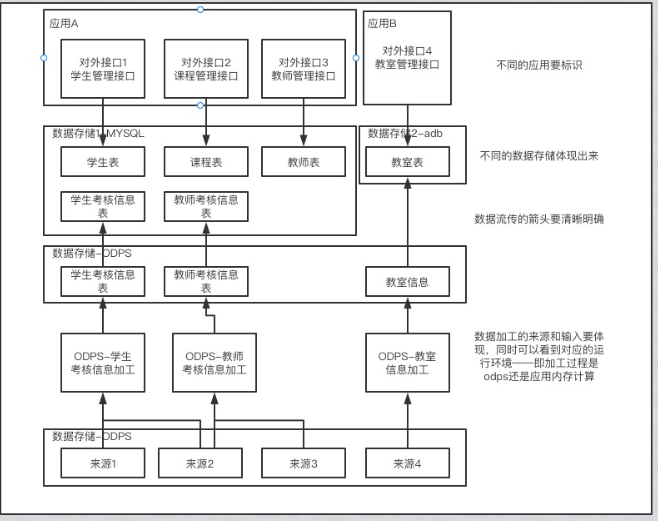

技术方案需要解决的问题：

* 符合产品方案，符合达成目标
* 测试可以根据此进行验证测试用例的输入、输出
* 同事&Leader：可以根据此得出技术实现路径

好的技术方案：

* 目标明确
* 降低沟通成本
* A/B/C...方案的优劣势

#### 写好技术方案步骤

##### 1、清晰的目标

需求来源：产品经理提出的产品/系统需求；技改类需求。明确需求带来的“收益”及ROI。

##### 2、数据流转图

目的：

* 梳理需求，熟悉业务模块之间的交互（如果刚接手一个项目也可从此入手）
* 如果涉及到微服务，至少关联到三层，以防后面出问题，排查找不到人
* 探索是否需要进行小范围重构

##### 3、模型设计：E-R图、数据库表关系图

每个领域对象抽象到位，划分不好很容易黏连或后期需要合并，核心域划分粒度一定要控制好。

领域对象之间关系，可以通过代码来表示，具体参照DDD划分。

领域对象名称即表名。

定义出字段类型、长度、枚举等。

##### 4、外部服务

需要redis：key、value是什么样的，用的什么方法

需要分布式调度：业务调度流程图

需要消息系统：topic、格式是什么，数据怎么流转的

及外部服务出现问题的应急处理方案

##### 5、内部服务

对应的模块应用层是否具备满足需求的服务，如果没有需要开发；如果存在，要明确调用逻辑。

##### 6、模块应用层接口

接口需要定义出、入参是什么样的，最好有统一的接口管理工具。

接口需要有详细的时序图或者流程图。

#### 技术选型分析

至少列出2种技术方案，对比总不能一个对比吧。

从需求目标可落地、实现难度、可维护、可扩展等方面进行阐述

#### 安全生产

监控、对账、灰度、数据隔离、兼容性评估、发布流程等

技术方案可能出现的问题点列出，然后一个一个进行安全收尾。你不可能全列出来，这个时候就是被动触发，需要进行监控、对账等等。出现问题以后可以按照预定方案进行处理。

同时做好上线记录，方便进行代码回滚。

### yyyy-MM-dd需求名称

# ·     [一、背景](#yyyyMMdd需求名称-一、背景)

# ·     [二、目前进度](#yyyyMMdd需求名称-二、目前进度)

# ·     [三、需求描述及相关文档地址](#yyyyMMdd需求名称-三、需求描述及相关文档地址)

# ·     [四、技术设计](#yyyyMMdd需求名称-四、技术设计)

# ·     [五、测试用例](#yyyyMMdd需求名称-五、测试用例)

# ·     [六、影响范围](#yyyyMMdd需求名称-六、影响范围)

# ·     [七、上线前准备工作](#yyyyMMdd需求名称-七、上线前准备工作)

#### 一、背景

***

#### 二、目前进度

| **里程碑项/问题** | **时间** | **详细描述** | **答复** | **备注** |
| ----------------- | -------- | ------------ | -------- | -------- |
|                   |          |              |          |          |

#### 三、需求描述及相关文档地址

| **资料名称** | **链接** | **备注** |
| ------------ | -------- | -------- |
|              |          |          |

#### 四、技术设计

时序图、类图、流程图等

接口说明等

| **项目名称：分支** | **描述** | **备注** |
| ------------------ | -------- | -------- |
|                    |          |          |

#### 五、测试用例

 

#### 六、影响范围

 

#### 七、上线前准备工作

| **项**            | **内容**   | **备注** |
| ----------------- | ---------- | -------- |
| 例如：检查hsf配置 | alias：123 |          |

###  yyyy-MM-dd生产上线记录

#### ****项目

| **上线需求** | **技术文档** | **需求分支** | **是否合并上线分支：master_20220303** | **备注** |
| ------------ | ------------ | ------------ | ------------------------------------- | -------- |
|              |              |              |                                       |          |

#### checklist:

| **检查项** | **说明** |      |
| ---------- | -------- | ---- |
|            |          |      |
|            |          |      |

 

*资料*

[如何写出一篇好的技术方案？ (qq.com)](https://mp.weixin.qq.com/s/pHW7VGxA_tpApTwDbqOWQQ)