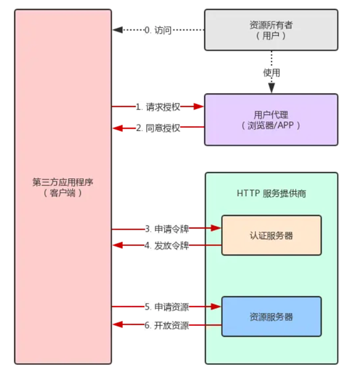

OAuth最早叫做"OpenAuth"，但AOL使用了这个名字，于是重命名为"OAuth"。一开始确实读作"Oath" (单音节)，但Leah Culver说应该读作 "Oh Auth"，代表不仅是授权之意，于是读音沿用至今。

单点登录CAS、Kerberos，第三方身份认证OpenID，第三方用户授权OAuth，联合身份认证和授权数据标准SAML等。OAuth主要用于三方登录和API鉴权。

假设我们在QQ空间中存储了照片，现在有个免费打印照片的机器。

用户名+密码：我们将我们的用户名和密码提供给这个机器，机器去访问我们在QQ空间的照片后执行打印程序。
这个方案我们无法保证机器只读取了有限范围的照片，可能也获取了好友信息。

##### OAuth：

通过这个授权流程，可以保证在不暴露密码的情况下，让机器去进行有限范围的操作权限，流程如下：

* 用户参与免费打印照片活动，点击获取QQ空间权限的连接
* 跳转到QQ空间走正常登录逻辑，弹出向机器授权的界面
* 用户选择授予照片权限模块，只读、有效期1小时，提交。
* 页面回到打印照片的界面，并携带QQ空间生产的**授权码**。
* 机器获得授权码之后，通过授权码向QQ空间发起读取照片的请求。
* QQ空间验证了授权码之后，向机器提供照片读取权限。

##### OAuth2.0的4种角色：

* 客户端：代表资源使用者，经授权后向受保护资源发起请求的应用程序。
* 资源所有者：资源的归属方，当资源所有者是人员时，就是用户。
* 授权服务器：对资源所有者进行认证并获取授权后，向客户端颁发访问令牌（Access Token）。
* 资源服务器：托管受保护资源的服务器，通过访问令牌（Access Token）接受和响应受保护的资源请求。

**访问令牌：**是在资源所有者许可下，授权服务器下发给客户端的一个凭证，主要在时间范围和权限范围两个维度进行控制。

**刷新令牌：**访问令牌是有时间限制的，可以保证在访问令牌泄露的情况下，不至于造成太大的影响。如果这个时间很短，就会造成用户频繁进行授权。为了解决这个问题，在下发访问令牌的时候，同时下发刷新令牌，刷新令牌的失效时间长于访问令牌，在访问令牌失效的时候，可以通过刷新令牌，重新获取访问令牌。(这不相当于给了访问令牌*2)

**回调地址：**客户端在注册时填写自己的回调地址

**权限范围：**访问令牌自带过期时间，客户端请求授权时指明需要的权限范围，并进行弹窗展示给用户。

##### OAuth2.0的四种模式

**1、授权码模式**

- 客户端携带 client_id, scope, redirect_uri, state 等信息引导用户请求授权服务器的授权端点下发 code
- 授权服务器验证客户端身份，验证通过则询问用户是否同意授权（此时会跳转到用户能够直观看到的授权页面，等待用户点击确认授权）
- 假设用户同意授权，此时授权服务器会将 code 和 state（如果客户端传递了该参数）拼接在 redirect_uri 后面，以302形式下发 code（如果使用浏览器，302会重定向到指定url）
- 客户端携带 code, redirect_uri, 以及 client_secret 请求授权服务器的令牌端点下发 access_token （这一步实际上中间经过了客户端的服务器，除了 code，其它参数都是在应用服务器端添加）
- 授权服务器验证客户端身份，同时验证 code，以及 redirect_uri 是否与请求 code 时相同，验证通过后下发 access_token，并选择性下发 refresh_token

**2、隐式授权模式**

有些事纯前端应用，没有后端。

- （A）客户端将用户导向认证服务器。
- （B）用户决定是否给于客户端授权。
- （C）假设用户给予授权，认证服务器将用户导向客户端指定的”重定向URI”，并在URI的Hash部分包含了访问令牌。
- （D）浏览器向资源服务器发出请求，其中不包括上一步收到的Hash值。
- （E）资源服务器返回一个网页，其中包含的代码可以获取Hash值中的令牌。
- （F）浏览器执行上一步获得的脚本，提取出令牌。
- （G）浏览器将令牌发给客户端。

**3、资源所有者密码凭证模式**

把密码、账号都存在客户端应用中。使用密码和账号申请令牌。

- （A）用户向客户端提供用户名和密码。
- （B）客户端将用户名和密码发给认证服务器，向后者请求令牌。
- （C）认证服务器确认无误后，向客户端提供访问令牌。

**4、客户端凭证模式**

适用没有前端的应用，后端直接处理。客户端凭据授予类型必须仅供指定机器使用。

- （A）客户端向认证服务器进行身份认证，并要求一个访问令牌。
- （B）认证服务器确认无误后，向客户端提供访问令牌。

*资料*

[OAuth 2.0 授权认证详解 (qq.com)](https://mp.weixin.qq.com/s/Ck6fcXHhvddxkP38mO7N9g)