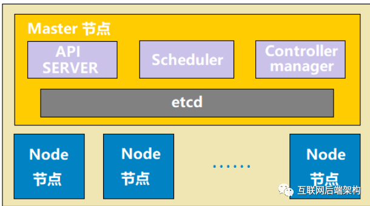
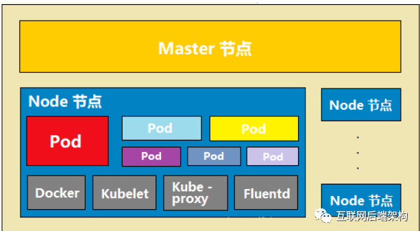

`使用Go语言开发`、`云管理平台`、`编排`、`管理容器`、`部署运行`、`资源调度`、`服务发现`、`伸缩`

- api server：相当于 k8s 的网关，所有的指令请求都必须经过 api server
- scheduler：调度器，使用调度算法，把请求资源调度到某个 node 节点
- controller：控制器，维护 k8s 资源对象（CRUD：添加、删除、更新、修改）
- etcd：存储资源对象（服务注册、发现等等）

- docker：运行容器的基础环境，容器引擎
- kubelet：每个 node 节点都有一份kubelet，在 node 节点上的资源操作指令由 kuberlet 来执行，scheduler 把请求交给api ，然后 api sever 再把信息指令数据存储在 etcd 里，于是 kuberlet 会扫描 etcd 并获取指令请求，然后去执行。kubelet 负责本地的 pod 的维护，CRUD。
- kube-proxy：代理服务，负责负载均衡，在多个 pod 间负载均衡
- fluentd：日志收集服务
- pod：k8s 不直接管理容器，而是管理 pod，pod 内部可以有一个或多个容器。