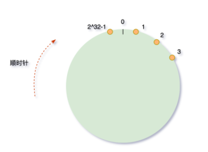
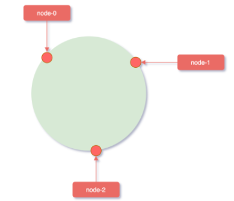
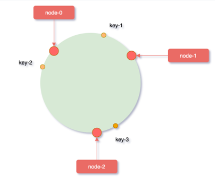
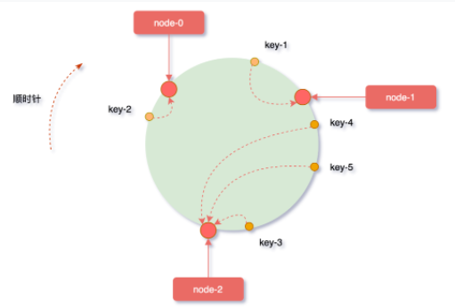
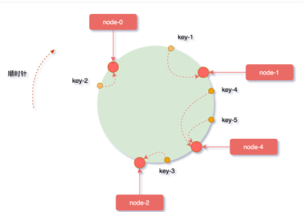
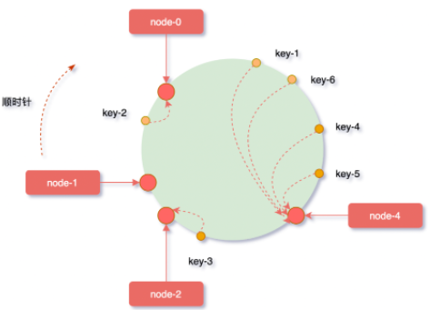

#### hash算法

hash是指将**任意长度**的输入转变为**固定长度**的输出

特点：
	* 不可逆

	*  冲突少
	*  快速

一般hash算法取模后，如果一个节点不可用，那么所有落在这个节点的key都不可用。故提出了一致性hash算法。

#### 一致性hash算法

本质也是取模算法，不同于一般取模，一致性hash算法是对**固定值2^32进行取模运算**。

##### Hash环

hash环：通过构建2^32-1个节点串成一个环。

假设有3台服务器，通过key来进行分流：

一般hash算法：hash(key)%3 ,计算出来的值映射到固定的三台机器上。

一致性hash算法：

*step1：*对通过对服务器的IP进行hash：hash(服务器IP)%2^32,计算出来的值映射到hash环。

*step2：*对key进行hash：hash(key)%2^32,计算出来的值映射到hash环。

*step3：*key映射到服务器：从key的位置开始顺时针方向，遇到第一个服务器节点则是映射到的服务器。

**一致性hash算法优势：优化添加、减少服务节点带来的不可用问题。**

扩容一台服务器node-4，经过hash后落在node-1与node-2之间，扩容后受影响的只是key4、key5，减少了影响范围。

同样的原理，如果减少一个节点，影响的也是该节点之前区间范围的key。

一致性hash算法的缺点：节点数量过多或更新频繁，性能就会受到影响。

##### 数据偏斜问题：

hash计算后的值，很容易因为**服务节点分布不均匀**导致数据偏斜。

解决方案：

1、虚拟节点：对每个服务器节点计算出多个hash值，这样呢就相当于分布了很多机器出去。虚拟节点的hash计算可以采用，节点IP+数字编码后缀，例如：hash(127.0.0.1#1)。如果虚拟节点过少，效果不明显。

*资料*
[hash算法的数学原理是什么，如何保证尽可能少的碰撞？ - 知乎 (zhihu.com)](https://www.zhihu.com/question/20507188)

[面试高频：一致性hash算法 (qq.com)](https://mp.weixin.qq.com/s/4S32MvRIjONnGYiEWwHLcQ)