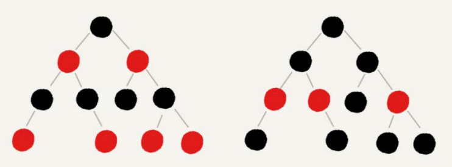
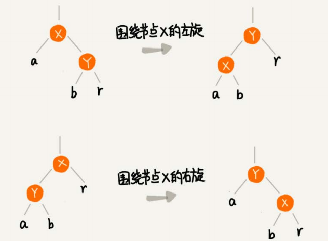

##### 

节点高度：节点到叶子节点的最长路径->从叶子往根节点看，0开始
节点深度：根节点到该节点所经历边的个数->从根节点往叶子看，0开始
节点层数：节点深度+1->从1开始，1/2/3层
树的高度：根节点高度

#### 二叉树 

每个节点最多有两个子节点，可以有一个，或者没有。

**满二叉树**：每个节点都有两个子节点，不缺。
**完全二叉树**：最后一层的左子节点都不缺。完全二叉树是最节省内存的一种方式，堆就是一种完全二叉树。
**二叉查找树(二叉搜索树/二叉排序树)**：左子节点小于父节点，右子节点大于父节点。支持动态数据的快速插入、删除、查找。

##### **存储二叉树：**

* 基于指针的二叉链路存储：

* 基于数组的顺序存储：
  root节点存储下标1的位置；左子节点=```2*i```的位置；右子节点=```2*i+1```位置；i为层数；i/2，i>1=父节点位置；
  * 如果不是完全二叉树会浪费很多空间

##### 遍历二叉树

* 前序遍历：先打印父节点，然后左子树，右子树

* 中序遍历：先打印左子树，父节点，右子树

* 后序遍历：先打印左子树，右子树，父节点

  每个节点最多会遍历两次，所以遍历的时间复杂度是O(n)

##### 遍历、插入、删除二叉查找树


**中序遍历二叉查找树**：输出有序序列，时间复杂度O(n)

​	**支持重复数据的二叉查找树**：
​		方案1：把值相同的数据都存储在同一个节点上
​		方案2：如果值相同，将相同值的数据插入到该节点的右子树，作为右子树的左节点。即值相同，作为大于当前节点的值处理。查找、删除的时候，要遍历到叶子节点才行。

​	**二叉查找树操作时间复杂度分析：**
​	

左1：退化成链表了，时间复杂度是O(n)
右1：完全二叉树，时间复杂度是O(logN)

##### 二叉查找树与散列表

​	散列表的操作可以达到O(1)，为什么还有二叉查找树？
 * 散列表无法有序输出

 * 散列表扩容耗时，而且遇到散列冲突时，性能不稳定。

 * 在数据量大的时候，散列表hash冲突的存在性，查找速度效率下降

   具体可参照JDK1.8中HashMap的存储实现方式

##### 平衡二叉查找树

平衡二叉查找树定义：任意节点的左右子树的高度相差不能大于1。

[AVL树](https://zhuanlan.zhihu.com/p/34899732)定义：左右子树的高度差小于等于 1，并且每一个子树均为平衡二叉树。

平衡二叉查找树的意义在于**平衡**二字，不要出现左子树很高，右子树很矮的异常情况。这样可以使插入、删除、查找的时间复杂度相对理想。平衡=性能不退化。

##### 平衡二叉查找树与红黑树

平衡二叉查找树的定义相对严格，只要树的高度不比log2n大很多，尽管不符合严格的平衡二叉查找树定义，但可以称为合格的平衡二叉查找树，即红黑树。

红黑树名气比平衡二叉查找树要大，所以一般情况下，提到红黑树就认为是平衡二叉查找树。平衡二叉查找树其实有很多，例如，伸展树、树堆等

##### 红黑树(R-B Tree)

红黑树不是一个严格的平衡二叉查找树。

定义：

* 1.根节点是黑色

* 2.每个叶子节点都是黑色的空节点，即叶子节点不存储数据（一般情况下，图示默认省略该节点）

* 3.每个节点到达其所有叶子节点的路径，都包含相同数目的黑色节点

* 4.树中不存在两个相邻的红色节点（红色节点的父节点和子节点只能是黑色）

  

伸展树、树堆等在极端情况下，会产生时间复杂度的退化；AVL树需要一个负载因子进行维护它的高度平衡二叉查找树结构，每次删除、插入AVL效率不高。红黑树只是做到了相对平衡的结果，性能相对稳定，从工程角度讲这就是合适的技术。	

##### 红黑树的实现

实现比较难，一般用跳表实现。



插入操作的平衡调整

红黑树规定，插入节点必红色。并且，二叉查找树新节点的插入，节点放在叶子节点

删除操作的平衡调整

第一次操作：初调，满足第三条定义

第二次操作：满足第四条定义
