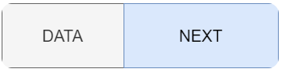
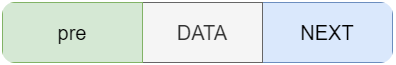
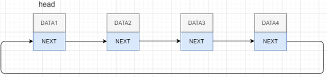

##### 顺序存储-数组

​	数组的缺点就是插入、删除元素；还有就是需要足够的空间。

##### 链式存储-链表

​	由于数组的缺点，造就了链式存储。

链表基本思想是在结构体中加入额外的空间去存储下一个节点的指针，这样一个一个就“链"起来了。

##### 单链表

​	有着链表特色的最简单的数据结构形式。

​	

##### 双向链表

​	在单链表结构基础上增加”头指针“。
​	

##### 环单链表

​	在单链表结构基础上，将最后一个节点的尾指针指向第一个节点。
​	

##### 环双向链表

​	在双向链表基础上，将最后一个节点的尾指针指向第一个节点。

