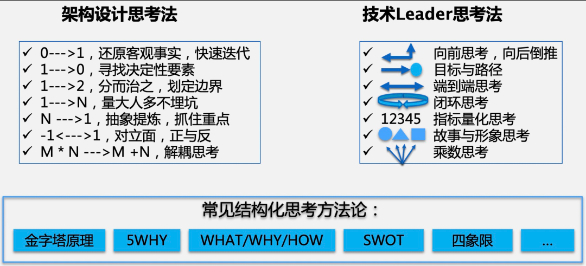

加入创业公司不久，孔凡勇主要工作围绕着团队和业务做梳理，和团队核心成员一对一沟通交流。主要核心工作包括四个方面：

1. **研发流程标准化。**包括从发版计划，PRD 标准，到需求评审会议的流程优化，架构设计评审、代码评审，再到发布复盘计划等，各项标准化流程逐一建立起来。
2. **研发效能。**基于上述流程标准化，制定产研团队同售前、售后等团队的边界分工，各负其责，避免一些不必要的争执，风险、问题能够及时暴露，确保各环节高效顺，同时在 CI/CD、DevOps 环节基于自动化工具提高研发效率，避免一些重复劳动。
3. **人才招聘。**随着公司业务快速发展，亟需各类技术人才。对于一家创业公司来说，吸引优秀人才不太容易。最重要的能够招到合适的人才，能够有创业心态，能够和公司一起共同成长。
4. **架构升级。**随着业务快速发展，系统架构的腐蚀避免不了，尤其对于 B 类客户不同租户需求有差异性，对系统架构可扩展性要求比较高，很多时候牺牲未来来满足当下的一些需求，时间久了对系统架构造成一定的冲击。所以一开始孔凡勇就着重去了解系统在架构、性能等维度存在一些问题，以及接下来的一些优化计划。

##### 1、向前思考，向后倒推

向前思考：未来发展的预判。

* 对上你的信息更细致，对下你的信息更全面，所以未来发展要有自信。
* 只要你的判断合理有逻辑，与大家能够达成共识，结果只能交给历史进行批判了。
* 未必一定要有把握、最正确的事情。

向后倒推：当前有什么条件，以及怎么做的问题。

##### 2、目标与路径

* 目标一定是用来完成的：不一定是100%达成，关键是对组织的价值贡献。
* 路径执行时被惯性带走：对大目标进行拆解成小目标，小目标做着做着原目标忘了。还要定时回头看。

##### 3、端到端思考

尽可能的关注全链路，而不是只关注自己这一块。

界限：把全流程画出来，大家先基于客观事实把流程达成一致，然后基于这个流程确认界限。

背景：基于什么背景，各个领域要达成什么目标，每个目标达成的时间点。用表格的形式列出。

##### 4、闭环思考

从初心出发，再回到初心。

步骤：

\1) 觉察/认知（感知到现有平台/系统的问题，感觉需要做架构调优升级）

\2) 概念/原理（挖掘到问题背后的本质，从业务原理/技术原理等底层出发抽取概念和本质）

\3) 理解/共识（对问题本质做宣讲，达成上下左右的理解与共识）

\4) 目标/路径（提出目标，拆解出来可实施的路径）eg:很多到此结束，没有表格跟踪，最后拿不到结果

\5) 表格/指标（提出衡量的指标和具体的 ACTION，最好的就是表格来跟进）

\6) 小胜即庆 （对于阶段性目标的达成进行庆祝，当然这也是咬合业务价值的关键点）eg：很多到此结束，交接出去了，缺乏持续跟进，导致严重建设障碍。leader此时思考下一步，确保下一个闭环能够开启。

\7) 持续跟进 （小胜即庆还不能放松警惕，还需要持续推进到下一个任务）

\8) 灵活应变 （根据实际情况调整优先级，同样是咬合业务价值而不是固守之前的任务表格）

\9) 目标完成 （完成标准不是新平台/系统能力建设完成，而是完成模型统一，流量迁移完成，老代码下线等）

\10) 下一个觉察 (开启下一个平台/系统的架构调优升级周期）

##### 5、指标量化思考

没有量化，就无法衡量优化。在解决问题的时候，思考如何对问题进行量化。

* 量化维度的客观性：量化本质是让你更全面、更客观理解问题。如何高效的满足客户的需求。
* 解读量化指标：横向、平均、环比

##### 6、故事与形象思考

通过故事的形象思考，尽可能将问题讲透，让人容易理解。

* 踏实肯干比能说会道重要，前者才是硬实力：人类的本质就是基于共同想象，一定要把自己的事情讲清楚。
* 技术有门槛，不愿意和门外汉沟通：讲故事、打比方这种形象化的思考方式。

##### 7、乘数思考

思考技术命题时，充分考虑它的影响力。双刃剑，好的、坏的影响都大。

* 审慎自上而下的决策：执行难度未合理评估；执行结果未检查，导致走偏。
* 主动管理自下而上：要对可能出现的问题进行纠正(重复建设)，对全局有利的，及时推广并主动解决过程中的障碍。

*资料*

[下篇：技术 Leader 的思考方式 (qq.com)](https://mp.weixin.qq.com/s/ypXzVdmg8yFrhE_lDwZl2g)
