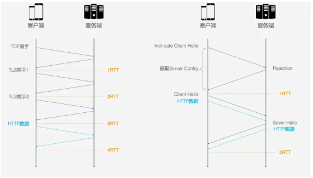
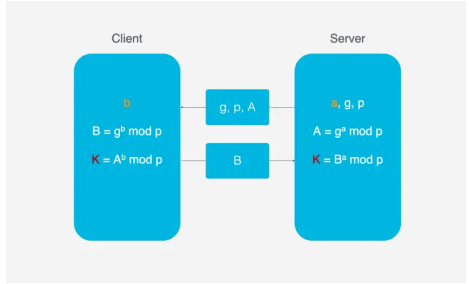

#### HTTP3

http3是在保持QUIC稳定性的同时，使用UDP实现高速传输，又保证了TLS的安全性。

#### 特点：

##### 1、0RTT建立连接

RTT：**往返延时=链路传播时间+服务端处理时间+路由器缓存中的排队和处理时间**。链路传播时间+服务端处理时间=TCP连接相对固定时间，那么**RTT的抖动反应了网络阻塞程度**。

HTTP2建立连接需要3RTT，如果会话复用也是2RTT。如果使用TLS1.3则需要2RTT，会话复用使用1RTT。

HTTP3建立连接需要1RTT，如果复用0RTT。浏览器第一次发送数据包就带有请求数据。

1.首次连接，浏览器发送Inchoate Client Hello，用于请求连接。

2.服务端生成a,g,p，并根据g,a,p计算出A，然后将g,p,A返回给浏览器。

3.浏览器收到g,p,A，自己生成一个b，用g,b,p生成B；用A,b,p生成初始密钥K，将K加密和B再次传输给服务器。

4.服务器收到加密K和B，B,a,p计算出密钥K，然后用密钥K解析加密的K，

##### 2.连接迁移

TCP连接基于四元组(源IP, 源端口, 目的IP, 目的端口), 切换网络时至少会有一个因素发生变化, 导致连接发送变化。

QUIC使用一个64位的随机数, 这个随机数被称为Connection ID, 即使IP或者端口发生变化, 只要Connection ID没有变化, 那么连接依然可以维持。

##### 3.队头阻塞

QUIC基于UDP, UDP的数据包在接收端没有处理顺序, 即使中间丢失一个包, 也不会阻塞整条连接. 其他的资源会被正常处理.

##### 4.拥塞控制

TCP的拥塞控制：

* 慢启动：浏览器向服务器发送1个单位的数据，收到确认后发送2个单位数据，然后是4、8...依次增长，这个过程中不断试探网络拥塞程度。
* 避免拥塞：指数上涨到一个限制之后，指数增涨变为线性增长。
* 快速重传：浏览器每次发送都会设置一个超时时间，超时后认为丢失，然后进行重发。
* 快速恢复：浏览器重新发送数据时，会启动一个超时定时器，如果收到确认消息则进入拥塞避免阶段；如果依然超时则进入慢启动。

QUIC的拥塞控制：

* 热插拔：用户动态选择拥塞控制算法
* 向前纠错FEC：一个数据被切分10个包，每一次都对包进行异或运算，运算结果加入到FEC包与数据包一同发送，如果传输过程丢包，可以根据剩余的包推算出丢失包的内容。*考虑到现阶段带宽已经不是限制传输的瓶颈，RTT才是，所以新的网络传输协议可以适当增加冗余数据，减少重传操作。*

##### 5.连接控制

TCP通过滑动窗口进行流量的控制。

QUIC的流量控制有两个级别：

* 连接级别：接收窗口=流1接收窗口+流2接收窗口+...
* 流量级别：接收窗口=最大接收窗口-已接收数据
  * 流没传输数据时，接收窗口就是最大窗口；
  * 随着接收数据，接收窗口不断缩小；
  * 然后不断处理，接收窗口也会涨回来。

*资料*

[HTTP/3发布了，我们来谈谈HTTP/3 (qq.com)](https://mp.weixin.qq.com/s/wvjzYrt3_myzIBkS4Ds7XA)