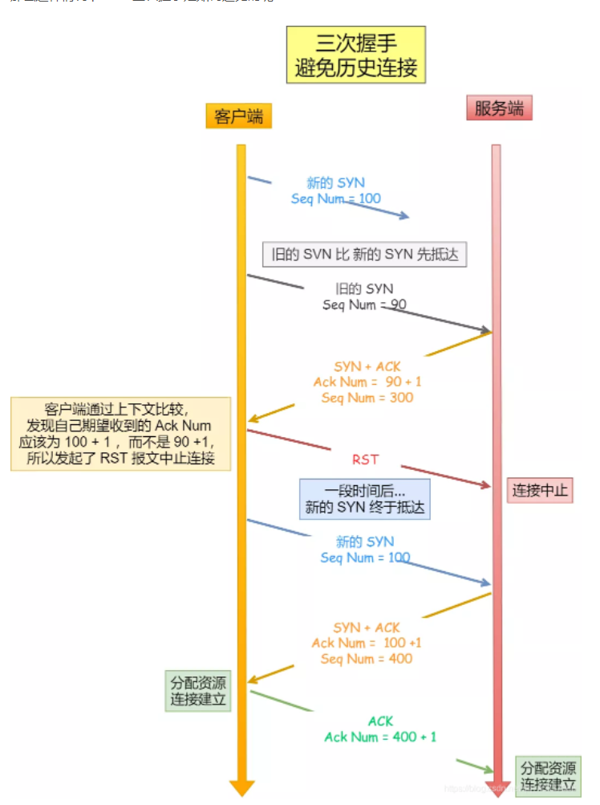
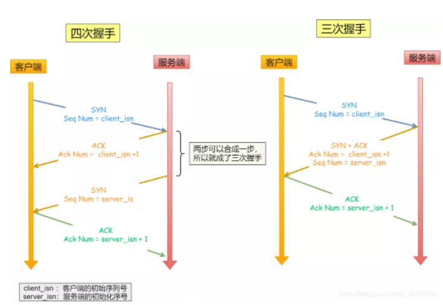
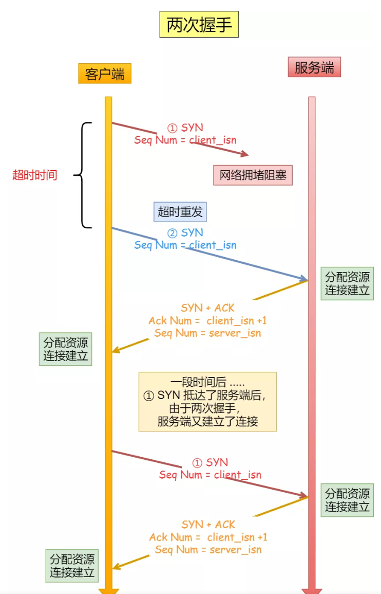
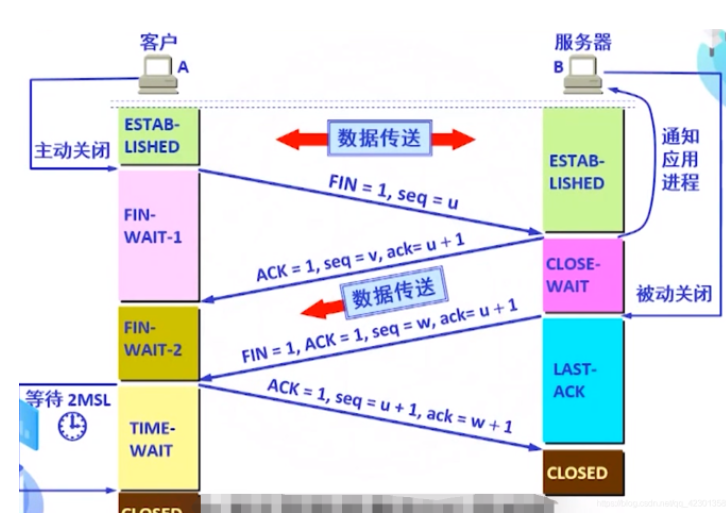

#### TCP三次握手

TCP三次握手是客户端与服务端*建立连接*的方式，方便后续的数据传输。

第1次握手，客户端向服务端发送SYN标识的**连接请求数据包**

* 服务端处于**监听**状态；客户端发送完之后处于**同步已发送**状态

第2次握手，服务端向客户端返回SYN+ACK标识的**连接请求和应答数据包**

* 服务端返回之后处于**同步已接收**状态；客户端还是**同步已发送**状态

第3次握手，客户端向服务端发送ACK标识的**应答数据包**，并可携带数据。

* 服务端收到请求后处于**连接建立**状态；客户端发送后**连接建立**状态

##### 为什么是三次握手？

3次才会**阻止重复连接**、**阻止历史连接**、**同步双方初始序列号**，2次不够，4次太多。

###### 阻止历史连接:

客户端向服务端发送连接请求，客户端进入等待应答，如果等待超时，客户端会重新发起连接请求，如果网络阻塞，使得先发送的数据包先到达。**客户端在此时发出RST连接终止**，新的请求会建立新的连接。

###### 同步双方初始序列号:

TCP双方都维护一个序列号，序列号的可靠传输是一个关键因素。
2次握手只能保证客户端序列号同步，无法保证服务端的序列号同步。
4次握手可以保证两方的序列号同步，但是可以进行优化。

初始序列号：随机产生，如果不随机可进行伪造，不安全

**序列号的作用**：
客户端先发送携带`初始序列号`的SYN给服务端；服务端将`初始序列号`和客户端`初始序列号`+1返回；客户端再发送服务端`初始序列号`+1请求给服务端；这样保证了序列号的可靠同步。

* 接收方可以去除重复的数据
* 接受方可以根据数据包的序列号按序接收
* 可以标识发出去的数据包，那些是已被接收的

###### 避免重复连接：

2次握手：客户端发送SYN阻塞在网络中，客户端确认超时后会重新发送SYN；服务端不清楚客户端是否收到了ACK，所以每次收到SYN都会对应建立一个连接，服务端就会建立很多无效的连接，进而耗费资源。

#### SYN攻击

属于DoS攻击的一种，发送大量伪造IP第一次握手SYN，**服务端每接收到一个SYN就会分配核心内存放入*半连接队列***，进而影响正常请求。

#### TCP四次挥手

通信双方都可以释放连接

step1：假设客户端发起断开连接请求(FIN和SEQ)，并进入**终止等待状态**(FIN-WAIT)。SEQ=随机序列号，FIN=1。

step2：服务端收到断开连接请求后，返回ACK(收到断开请求)=客户端发过来的SEQ+1、SEQ=随机序列号

step3：服务端收到断开连接请求后，不会马上断开。先确认断开前所有数据已经传输完毕，确认传输完毕才会进行断开。向客户端返回FIN、ACK、SEQ。FIN=1，SEQ=随机序列号，ACK=客户端发过来的SEQ+1

step4：客户端收到服务端返回后，发送ACK(收到断开TCP连接数据包)和SEQ到服务端。SEQ=服务端返回的ACK+1，ACK=服务端返回的SEQ+1

#### TCP滑动窗口

流量控制，让发送方不要发的太快，得让接收方有处理的时间。

#### TCP队头阻塞

TCP是有序传输数据包，那么浏览器在与服务器之间建立一条TCP连接后，可以创建多个流。如果双方有一个数据包在网络中丢失，或者网络中断都会造成整个TCP连接的暂停，丢失的数据包将会重新传输到目的地。那么此时的暂停，会导致其他流进入等待，这就是tcp队头阻塞。

#### TCP拥塞控制

`基于丢包的拥塞控制算法的缺陷`

20世纪80年代，拥塞控制算法直接把丢包等价于拥塞，需要降低发送速率。但经过网络硬件的高速发展，带宽逐渐增大，如果简单的认为丢包是拥塞引起，此时将不成立。

基于丢包的拥塞控制算法首先会填满网络中的缓存，当缓存填满后出现丢包才开始降低发送速率。如果缓存比较大，那么久会造成延迟。也就是说大缓存也会造成延迟的发生，故不能基于丢包来估计拥塞。

TCP链路的传输性能参数：RTT往返时间和瓶颈带宽。在还没有达到带宽瓶颈时，rtt决定着链路性能。
`带宽时延积BDP=带宽*RTT`，则有优点数据包数量=BDP。继续增加数据包，超出BDP的会占用缓存，达到瓶颈带宽的TCP，投递率此时稳定下来，RTT会增加；继续增加数据包，缓存被占满后发生丢包。

过去基于丢包的拥塞算法，直到缓存填满，发生丢包，将发送窗口减半后再线性增加。

过去存储器昂贵，其大小只比BDP大一点，延迟不会很明显；现在存储器便宜，远大于BDP，此时延迟就会很明显。

##### **BBR算法**

既然丢包无法标识出网络的拥塞，那就**通过观测和量化链路的带宽和RTT来标识网络拥塞**。

##### **BBR主要分为四个阶段：**

1、启动阶段：探测网络带宽，尽可能快的占满管道，经过三次发现投递率不再增长，说明管道被占满，开始占用缓存。

2、排空阶段：指数级降低发送速率，将缓存排空。

3、稳定工作阶段：BBR进入稳定工作态，BBR不断改变发送速率进行**带宽的探测**：先在一个RTT时间内增加发送速率探测最大带宽，若RTT没有变化后减少发送速率，排空前一个RTT多发出来的数据包，后面6个周期使用更新后的估计带宽发包。

4、延迟探测阶段：BBR设定了最小RTT的超时时间为10s。每过10s，会进入非常短暂延迟探测阶段。为了**探测最小延迟**，BBR在该阶段仅发送最少量的包。

98%的时间用于带宽探测。

#### 数据包丢失

1、第一次握手SYN丢失：重传，重传次数超过阈值后放弃。

2、第二次握手ACK、SYN丢失：客、服都重传。

3、第三次握手ACK丢失：

服务端会一直重传ACK、SYN，直到超过阈值放弃。

客户端分是否开启保活机制：

* 客户端开启保活机制：经过X小时之后发现死亡连接，客户端主动断开
* 客户端未开启保活机制：客户端重传，直到重传次数超过阈值，然后断开连接。

*资料*

[(27条消息) TCP-三次握手_况祥彬的博客的博客-CSDN博客_tcp三次握手](https://blog.csdn.net/qq_40337086/article/details/112443124)

[TCP四次挥手断开连接的过程 (biancheng.net)](http://c.biancheng.net/view/6428.html)

[TCP BBR 拥塞控制算法成倍提升访问速度背后原理 (qq.com)](https://mp.weixin.qq.com/s/tM0RHCnCGbctXl3EDSaSNQ)

[为什么需要QUIC | HTTP/3详解 (hungryturbo.com)](https://hungryturbo.com/HTTP3-explained/quic/为什么需要QUIC.html#tcp队头阻塞)